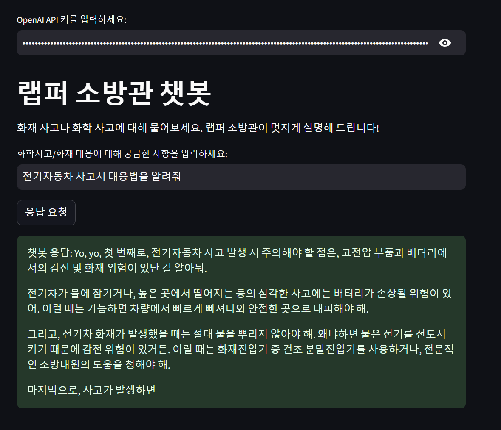

# TEAM PROJECT
 ## 개요 
 프로젝트 폴더 : kict240915_chatbot(류동경 로컬)  
 팀명 : 도전챗봇  
 팀원 : 박보람, 배소정, 류동경, 문소정  
 주제 : 특수화재(화확약품) 대응 가이드 챗봇  

 ## Installation(사용된 패키지) 

```

pip streamlit==1.38.0
pip openai==1.44.0
pip tiktoken==0.7.0
pip langchain==0.3.0
pip unstructured==0.15.12
pip nltk==3.7
pip python-magic
pip langchain-community
pip requests
```

## 결과예시


## RAG 파일
 

